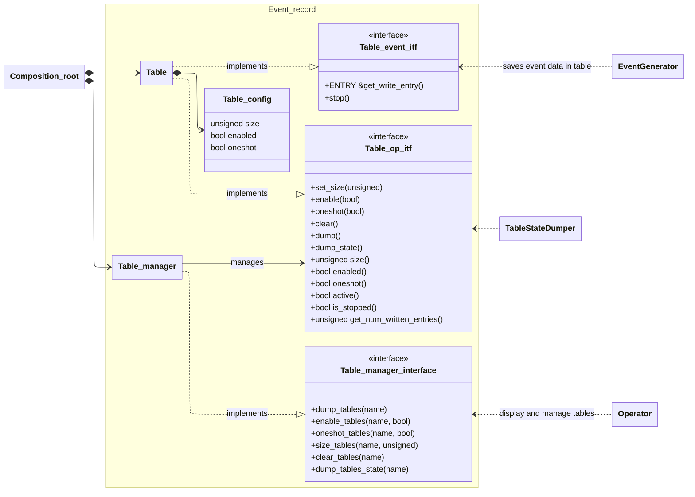

# Introduction
This C++ library records events that occur at run-time in RAM tables. The saved tables of events can subsequently be displayed and managed via a manager controlled by e.g. a Command Line Interface.

Many projects develop such facilities on an ad hoc basis when debugging a difficult problem. event_recorder provides a reusable implementation that can be incorporated into any application.

The type of data recorded by an event is chosen by the user of this library, but a typical application is to save two timestamps: a timestamp marking the beginning of event-handling and another marking the end.

The management of the tables is decoupled from the types of event recorded in the tables: one manager handles many tables, each possibly recording a different type of event. Due to the decoupling between tables and the management interface, when a new table recording a new event type is added, the code that interfaces to the CLI for displaying and managing the tables does not have to be modified or re-compiled.

Within the manager, each table has a name, and by carefully assigning the names the user can group the tables and manage them in groups. For example, say there are 4 tables for packet-handling events, named according to the protocols they handle and the packet direction: "rtcp-upstream", "rtcp-downstream", "dhcp-upstream", and "dhcp-downstream". The command "dump downstr" would dump the tables whose names contain this string, "rtcp-downstream" and "dhcp-downstream"; similarly "dump dhcp" would dump tables "dhcp-upstream" and "dhcp-downstream". Note that the manager has no knowledge of the domain, it selects tables by matching a string to the table names.

Tables are initialized with these properties, all of which can be changed at run-time:
- size: the number of entries that can be written to the table
- enabled or disabled: whether new events can be saved to the table or not.
- oneshot/rollover: one-shot tables stop recording when they are full; in rollover tables new events overwrite old ones.

The following diagram shows the relationship between the classes in the library (namespace Event_record), and the client entities that use the library.
- The Composition_root creates the Tables and associates them with their Table_manager.
- The Event Generator saves events in Tables.
- The Operator displays and manages tables, via their Table_manager.



# Building and installing the library
CMake projects can install and use this library as follows:
Clone project and enter the project directory. Then configure, build and install the library:
```sh
git clone ...
cd event_recorder
cmake -S . -B build -DCMAKE_BUILD_TYPE=Release
cmake --build build
cmake --install build --prefix <install-prefix>
```

# Using the library
If you build your project with CMake, then your project's `CMakeLists.txt` should include:

```cmake
find_package(event_recorder REQUIRED)

target_link_libraries(my_program
    PRIVATE
        event_recorder::event_recorder
)
```
And to configure your project:
```sh
cmake -S . -B build -DCMAKE_PREFIX_PATH=<install-prefix>
```
# Example code
This project includes two directories containing working sample applications.

## Directory 'example'
dependency_root.cpp defines two tables managed by one manager. One's entry type is an array of two timestamps, corresponding to the beginning and end of an event. The other's entry type is an integer.

## Directory 'example_early'
This example shows how event_recorder records events that happen before main() runs, because the event_recorder's initialization dependencies can be satisfied before main() runs.

# The manager interface
The operator controls the table via the manager interface. The following can be done via the manager interface:
- dump the contents of tables, using an entry-dump function written by the client
- enable or disable writing to tables
- change table mode: oneshot or rollover (during this change, the contents of the table is lost)
- re-size the tables (only while table is disabled)
- clear tables, i.e. delete all entries
- dump table state, using a function written by the client to display: table size, enabled/disabled, oneshot/rollover, number of entries in table, stopped (writing disabled not by management: e.g. oneshot table is full, or function stop() called)

Each of these operations can be applied to one or more tables, depending on whether the string passed to the manager matches the names of the table(s).

# Thread safety
For a given table, don't allow concurrent calls to get_write_entry(), i.e. either do this in one thread only or use a mutex.

Operator interface functions that modify data used by the event interface are only accessible when the table is disabled for writing, and the variable that controls this is atomic, thus ensuring there are no data races between event interface and operator interface. The operator interface functions in question are: set_size(), oneshot(), clear().

# Design
This library is loosely coupled to its clients:
- As shown in the example, if the user adds more Tables to a Table manager in composition_root.cpp, the code that manages and displays the Tables (in operator.cpp) does not have to change.
- The user can change the type of ENTRY in the Tables, and neither the event_recorder library code nor the code that manages and displays the tables (in operator.cpp) changes; the user just defines ENTRY and a function or class that dumps the contents of an entry, e.g. prints it to stdout.
- The client can change the functions that dump entries without changing the library or changing the code that manages and displays the tables (in operator.cpp in the example).
- In the client code, only composition_root.cpp depends on the library implementation; operator.cpp and operator_helper.cpp depend only on an interface, record_table_manager_itf.h, and event_generator.cpp depends only on another interface, record_table_event_itf.h. This makes operator.cpp, operator_helper.cpp and event_generator.cpp testable independently of this library.

# Todo
Manager commands could return more detailed error than 'command failed on 1 or more tables', or
report using the existing dump_name_callback, whose name could be changed to indicate more general
use.
